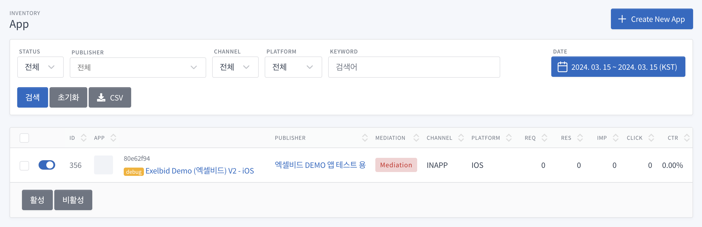
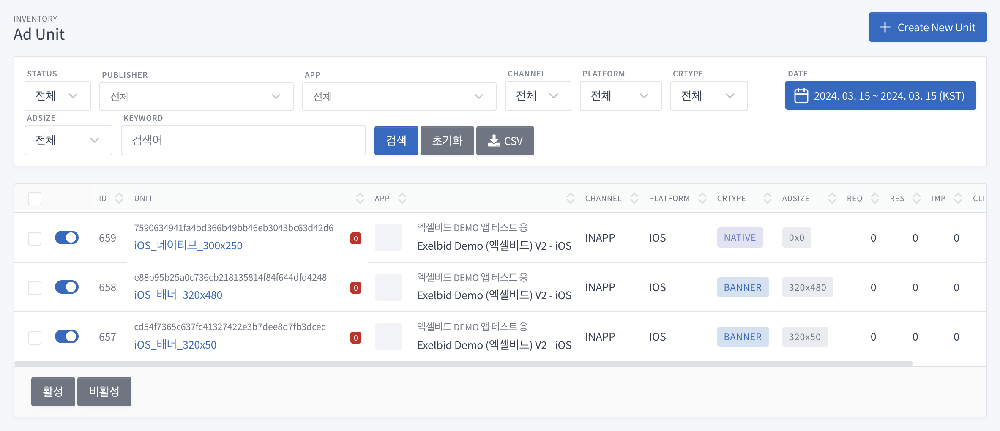

# Exelbid SDK for Flutter
Flutter Plugin 가이드입니다.  

목차
==========

- [Version History](#version-history)
- [Plugin 정보](#plugin-정보)
- [SDK 정보](#sdk-정보)
- [시작하기](#시작하기)
    - [Flutter Plugin 추가하기](#flutter-plugin-추가하기)
    - [Android 설정](#android-설정)
    - [iOS 설정](#ios-설정)
- [광고 적용하기](#광고-적용하기)
    - [인스턴스 공통 메소드](#인스턴스-공통-메소드)
    - [배너 광고](#배너-광고)
    - [전면 광고](#전면-광고)
    - [전면 비디오 광고](#전면-비디오-광고)
    - [네이티브 광고](#네이티브-광고)
- [미디에이션](#미디에이션)

# Version History
## 1.1.12
- mediation 초기화 수정

<br/>

[**Old Version History**](./CHANGELOG.md)

<br/><br/>

# 시작하기 전에

- Exelbid에서는 광고 요청에 대한 응답 후 노출까지의 시간(노출 캐시 시간)을 30분 이내로 권장합니다.(IAB 권장)
- 광고 응답 이후 노출 시간 차이가 해당 시간보다 길어지면 광고 캠페인에 따라서 노출이 무효 처리될 수 있습니다.

<br/><br/>

# Plugin 정보

Flutter 3.32.5

<br/><br/>

# SDK 정보
SDK 정보는 아래 링크를 참고해주세요.  

- [Android SDK 정보](https://github.com/onnuridmc/ExelBid-Android-SDK?tab=readme-ov-file#%EB%B9%8C%EB%93%9C-api-%EC%88%98%EC%A4%80)  
- [iOS SDK 정보](https://github.com/onnuridmc/ExelBid_iOS_Swift?tab=readme-ov-file#sdk-%EC%A0%95%EB%B3%B4)

<br/><br/>

# 시작하기

## Flutter Plugin 추가하기

### 명령어를 이용한 설치
다음 명령어로 종속성 추가 및 설치하세요.
```
flutter pub add exelbid_plugin
```

### 수동으로 설치
`pubspec.yaml` 파일에 종속성 설정을 해주세요.  
```
dependencies:
  exelbid_plugin: any
```

종속성 설정 후 다음 명령어로 설치하세요.  
```
flutter pub get
```

<br/>

## Android 설정

### AndroidManifest 설정

#### 필수 권한 설정
```xml
<uses-permission android:name="android.permission.INTERNET" />
<uses-permission android:name="android.permission.ACCESS_NETWORK_STATE" />

// 구글 정책(2022.03.15 발표)에 따라 대상 API 수준을 32(Android 13)로 업데이트하는 앱은 다음과 같이 매니페스트 파일에서 Google Play 서비스 일반 권한을 선언해야 합니다.(정책 적용 2022년 말 예정)
<uses-permission android:name="com.google.android.gms.permission.AD_ID"/>
```

#### 권장 권한 설정

```xml
<uses-permission android:name="android.permission.ACCESS_COARSE_LOCATION" />
<uses-permission android:name="android.permission.ACCESS_FINE_LOCATION" />
<uses-permission android:name="android.permission.ACCESS_WIFI_STATE" />
<uses-permission android:name="android.permission.CHANGE_WIFI_STATE" />
```

### Google Library 추가
ExelBid Android SDK가 제대로 작동하려면 Google Play Service 4.0 이상의 라이브러리가 필요합니다.  
광고 식별자 수집에 대한 Google Play 콘텐츠 가이드라인을 준수하기 위한 것입니다.  

#### 1. AndroidManifest.xml파일에 태그 안에 아래 코드를 추가합니다.
```xml
<meta-data
    android:name="com.google.android.gms.version"
    android:value="@integer/google_play_services_version"
/>
```

#### 2. Google Play Service jar를 dependencies에 추가합니다.
**poject structure** -> **dependencies** -> **add** -> **library dependency** 에서  
`com.google.android.gms:play-services` or `com.google.android.gms:play-services-ads`를 추가합니다.  

> \* eclipse를 사용하는 경우에는 Google Play Service 라이브러리 프로젝트를 추가합니다.

<br>

**build.gradle**
```groovy
dependencies {
    implementation("com.google.android.gms:play-services-ads-identifier:16.0.0")
}
```

<br>

## iOS 설정

### Info.plist 설정
광고 식별자 및 HTTP 트래픽 허용을 위한 권한을 설정합니다.  

Exelbid에서는 광고 요청등의 Api에 https를 사용하지만 Exelbid에 연결된 많은 광고주 플랫폼사들의 광고 소재 리소스(image, js등)의 원할한 활용을 위해 http사용 허가 설정이 필요합니다.  

1. Flutter 프로젝트에서 ios/Runner/Info.plist 파일을 엽니다.  
2. 아래 내용을 추가하세요.  
```xml
<key>NSUserTrackingUsageDescription</key>
<string>이 앱은 사용자 맞춤 광고를 제공하기 위해 광고 식별자를 사용합니다.</string>

<key>NSAppTransportSecurity</key>
<dict>
    <key>NSAllowsArbitraryLoads</key>
    <true/>
</dict>
```
<br/>

### 광고식별자 권한 요청
사용자로부터 개인정보 보호에 관한 권한을 요청해야 합니다.  
앱 설치 후 한번만 요청되며, 사용자가 권한에 대해 응답 후 더 이상 사용자에게 권한 요청을 하지 않습니다.  
광고식별자를 수집하지 못하는 경우 광고 요청에 대해 응답이 실패할 수 있습니다.  

**※ 광고를 호출하기 전에 완료되어야 합니다.**  
**※ 앱이 실행될때 광고식별자 권한 요청을 권장합니다.**

1. Flutter 프로젝트에서 ios/Runner/AppDelegate.swift 파일을 엽니다.
2. 아래 내용을 추가하세요.  
```swift
import AppTrackingTransparency

...

@main
@objc class AppDelegate: FlutterAppDelegate {

    ...

    override func applicationDidBecomeActive(_ application: UIApplication) {
        super.applicationDidBecomeActive(application)

        if #available(iOS 14.0, *) {
            ATTrackingManager.requestTrackingAuthorization { _ in }
        }
    }
}
```

<br/><br/>

# 광고 적용하기

1. Exelbid 계정을 생성합니다.
2. Inventory -> App -> Create New App
   

3. Inventory -> Unit -> Create New Unit
   

<br/>

## 인스턴스 공통 메소드
광고의 효율을 높이기 위해 나이, 성별을 설정하는 것이 좋습니다.

|Key|Type|Default|Desc|
|---|---|---|---|
|adUnitId|String||광고 아이디를 셋팅 합니다.|
|coppa|bool?|false|선택사항으로 미국 아동 온라인 사생활 보호법에 따라 13세 미만의 사용자를 설정하면 개인 정보를 제한하여 광고 입찰 처리됩니다. (IP, Device ID, Geo 정보등)|
|listener|EBPAdListener?|null|콜백 이벤트 리스너.|


#### 인스턴스 공통 스타일 클래스

#### EBViewStyle
```dart
EBViewStyle extends EBBaseStyle {
    final Color? backgroundColor;   // 배경색
    final double? borderRadius;     // 라운드
}
```

#### EBImageStyle
```dart
EBImageStyle extends EBBaseStyle {
  const EBImageStyle({
    super.backgroundColor,      // 배경색
    super.borderRadius,         // 라운드
    super.objectFit,            // 스케일 설정 (fit, crop)
  });
}
```

#### EBTextStyle
```dart
EBTextStyle extends EBBaseStyle {
  const EBTextStyle({
    super.color,            // 폰트 색상
    super.fontSize,         // 폰트 크기
    super.fontWeight,       // 폰트 두께
  });
}
```

#### EBTextStyle
```dart
EBButtonStyle extends EBBaseStyle {
  const EBButtonStyle({
    super.backgroundColor,      // 배경색
    super.borderRadius,         // 라운드
    super.color,                // 폰트 색상
    super.fontSize,             // 폰트 크기
    super.fontWeight,           // 폰트 두께
  });
}
```

<br/>

## 배너 광고

### 배너 광고 인스턴스

|Key|Type|Default|Desc|
|---|---|---|---|
|isFullWebView|bool?|true|광고 안에 너비 100%로 웹뷰가 바인딩되게 설정.|
|styles|EBViewStyle?|null|배너 광고의 스타일 설정.|

<br/>

```dart
EBBannerAdView {
    final String adUnitId;
    final bool? isFullWebView;
    final bool? coppa;
    final bool? isTest;
    final EBViewStyle? styles;
}
```

#### 예시)
```dart
EBBannerAdView(
    adUnitId: "<<Ad Unit Id>>",
    listener: EBPBannerAdViewListener(
        onLoadAd: () {
            print("Banner onLoadAd");
        }, onFailAd: (String? errorMessage) {
            print("Banner onFailAd");
        }, onClickAd: () {
            print("Banner onClickAd");
        }
    )
)
```

<br/>

### 배너 광고 이벤트 리스너
```dart
EBPBannerAdViewListener {
    /// 광고 요청 성공
    final Function() onLoadAd;

    /// 광고 요청 실패 (광고 없음)
    final Function(String? errorMessage) onFailAd;

    /// 광고 클릭
    final Function()? onClickAd;
}
```

<br/><br/>

## 전면 광고

### 전면 광고 요청
```dart
Future<void> loadInterstitial(
    {
        required String adUnitId,
        bool? coppa,
        bool? isTest
    }
)
```

#### 예시)
```dart
ExelbidPlugin.shared.loadInterstitial(adUnitId: "<<Ad Unit Id>>");
```

<br/>

### 전면 광고 보기
전면 광고 초기화가 이루어진 후 광고 보기를 요청해야 합니다.  
```dart
ExelbidPlugin.shared.showInterstitial();
```

<br/>

### 전면 광고 이벤트 리스너
```dart
EBPInterstitialAdViewListener {
    /// 광고 요청 성공
    final Function() onLoadAd;

    /// 광고 요청 실패 (광고 없음)
    final Function(String? errorMessage) onFailAd;

    /// 광고 클릭
    final Function()? onClickAd;

    /// 전면 광고가 화면에 표시된 후에 전송됩니다.
    final Function()? onInterstitialShow;

    /// 전면 광고가 화면에서 해제 된 후 전송됩니다.
    final Function()? onInterstitialDismiss;
}
```

<br/>

### 전면 광고 콜백 리스너 설정

#### 예시)
```dart
ExelbidPlugin.shared.setInterstitialListener(
    EBPInterstitialAdViewListener(
        onLoadAd: () {
            print("Interstitial onLoadAd");
        }, onFailAd: (String? errorMessage) {
            print("Interstitial onFailAd");
        }, onClickAd: () {
            print("Interstitial onClickAd");
        }, onInterstitialShow: () {
            print("onInterstitialShow");
        }, onInterstitialDismiss: () {
            print("onInterstitialDismiss"); 
        }
    )
);
```

<br/><br/>

## 전면 비디오 광고

|Key|Type|Default|Desc|
|---|---|---|---|
|timer|int?|0|광고의 전환 성과 향상을 위해 일정 시간 노출을 보장하는 타이머가 동작할 시간(초)를 설정한다.|

\* timer 지정은 AOS만 가능

<br/>

### 전면 비디오 광고 요청
```dart
Future<void> loadInterstitialVideo(
    {
        required String adUnitId,
        bool? coppa,
        bool? isTest,
        int? timer
    }
)
```

#### 예시)
```dart
ExelbidPlugin.shared.loadInterstitialVideo(
                              adUnitId: "<< Ad Unit Id >>",
                              isTest: "<< Is Test : true, false >>",
                              coppa: "<< Is COPPA : true, false >>",
                              timer: "<< Skip Timer : int >>",
                            );
```

<br/>

### 전면 광고 보기
전면 비디오 광고 요청 후 광고 보기를 요청해야 합니다.  
```dart
ExelbidPlugin.shared.showInterstitialVideo();
```

<br/>

### 전면 비디오 광고 이벤트 리스너
```dart
EBPVideoAdViewListener {
    /// 광고 요청 성공
    final Function() onLoadAd;

    /// 광고 요청 실패 (광고 없음)
    final Function(String? errorMessage) onFailAd;

    /// 광고 클릭
    final Function()? onClickAd;

    // 광고가 화면에 표시된 후 전송됩니다.
    final Function()? onShow;

    // 광고가 화면에서 해제된 후 전송됩니다.
    final Function()? onDismiss;

    // 광고가 재생 실패시 전송됩니다.
    final Function(String? errorMessage)? onFailToPlay;
}
```

<br/>

### 전면 비디오 광고 콜백 리스너 설정

#### 예시)
```dart
ExelbidPlugin.shared.setVideoListener(
    EBPVideoAdViewListener(
        onLoadAd: () {
            print('Interstitial Video onLoadAd');
        },
        onFailAd: (String? errorMessage) {
            print('Interstitial Video onFailAd : $errorMessage');
        },
        onFailToPlay: (errorMessage) {
            print('Interstitial Video onFailToPlay : $errorMessage');
        },
        onClickAd: () {
            print('Interstitial Video onClickAd');
        },
        onShow: () {
            print('onInterstitial Video Show');
        },
        onDismiss: () {
            print('onInterstitial Video Dismiss');
        }
    )
);
```

<br/><br/>

## 네이티브 광고

### 네이티브 광고 인스턴스

|Key|Type|Default|Desc|
|---|---|---|---|
|nativeAssets|EBNativeAssets?|null|네이티브 광고 요청 시 필요한 항목들을 요청합니다.|
|styles|EBViewStyle?|null|네이티브 광고의 스타일 설정.|

```dart
EBNativeAdView {
    final Widget child;
    final String adUnitId;
    final List<String>? nativeAssets;
    final bool? coppa;
    final bool? isTest;
    final EBPNativeAdViewListener? listener;
};
```

#### 네이티브 광고 속성
```dart
class EBNativeAssets {
    // 제목
    static const String title = "title";

    // 아이콘 이미지
    static const String icon = "icon";
    
    // 메인 이미지
    static const String main = "main";

    // 설명
    static const String desc = "desc";
    
    // 클릭 버튼명 (유도문)
    static const String ctatext = "ctatext";
}
```

#### 예시)
```dart
EBNativeAdView(
    adUnitId: "<<Ad Unit Id>>",
    nativeAssets: const [
        EBNativeAssets.title,
        EBNativeAssets.main,
        EBNativeAssets.icon,
        EBNativeAssets.ctatext,
    ],
    listener: EBPNativeAdViewListener(
        onLoadAd: () {
            print("Native onLoadAd");
        }, onFailAd: (String? errorMessage) {
            print("Native onFailAd");
        }, onClickAd: () {
            print("Native onClickAd");
        }
    )
    child: "<<Native Ad View UI>>"
)
```

<br/>

### 네이티브 광고 UI
네이티브 광고 뷰 설정 시 아래 내용을 참고하여  
asset이 설정될 객체를 포함하여 구형하여야 합니다.

#### 네이티브 제목
```dart
EBNativeAdTtitle {
    EBTextStyle? styles;
}
```

#### 네이티브 설명
```dart
EBNativeAdDescription {
    EBTextStyle? styles;
}
```

#### 네이티브 메인 이미지
```dart
EBNativeAdMainImage {
    double? width;
    double? height;
    EBImageStyle? styles;
}
```

#### 네이티브 아이콘 이미지
```dart
EBNativeAdIconImage{
    double? width;
    double? height;
    EBImageStyle? styles;
}
```

#### 네이티브 액션 버튼
```dart
EBNativeAdCallToAction {
    EBButtonStyle? styles;
}
```

#### 온라인 맞춤형 광고 개인정보보호 가이드라인 아이콘
```dart
EBNativeAdPrivacyInformationIconImage {
    double? width;
    double? height;
    EBImageStyle? styles;
}
```

> 2017/07 방송통신위원회에서 시행되는 '온라인 맞춤형 광고 개인정보보호 가이드라인' 에 따라서 필수 적용 되어야 합니다.  
> 광고주측에서 제공하는 해당 광고의 타입(맞춤형 광고 여부)에 따라 정보 표시 아이콘(Opt-out)의 노출이 결정됩니다.  
> ※ 광고 정보 표시 아이콘이 노출될 ImageView의 사이즈는 NxN(권장 20x20)으로 설정 되어야 합니다.  


#### 예시)
```dart
EBNativeAdView(
  adUnitId: "<<adUnitId>>",
  nativeAssets: const [
    EBNativeAssets.title,
    EBNativeAssets.main,
    EBNativeAssets.icon,
    EBNativeAssets.ctatext,
  ],
  styles: const EBViewStyle(
    borderRadius: 20,
  ),
  listener: EBPNativeAdViewListener(onLoadAd: () {
    print("Native onLoadAd");
  }, onFailAd: (String? errorMessage) {
    print("Native onFailAd");
  }, onClickAd: () {
    print("Native onClickAd");
  }),
  child: Column(
    children: [
      Container(
        padding: const EdgeInsets.all(10),
        child: // 상단 이미지 및 텍스트 영역
            Row(children: [
          SizedBox(
            width: 48,
            height: 48,
            child: Center(
              child: EBNativeAdIconImage(
                styles: EBImageStyle(
                  backgroundColor: Colors.grey[300],
                  borderRadius: 20,
                ),
              ),
            ),
          ),
          const SizedBox(width: 10),
          Expanded(
            child: SizedBox(
              child: EBNativeAdTitle(
                styles: const EBTextStyle(
                  fontWeight: FontWeight.bold,
                ),
              ),
            ),
          ),
        ]),
      ),
      const SizedBox(height: 10),
      // 메인 이미지 뷰
      Expanded(
        child: SizedBox(
          width: double.infinity,
          height: double.infinity,
          child: Stack(children: [
            Center(
              child: EBNativeAdMainImage(
                styles: EBImageStyle(
                  backgroundColor: Colors.grey[300],
                  borderRadius: 10,
                ),
              ),
            ),
            Positioned(
              right: 10,
              top: 10,
              child:
                  EBNativeAdPrivacyInformationIconImage(
                width: 20,
                height: 20,
              ),
            ),
          ]),
        ),
      ),
      const SizedBox(height: 10),
      // 버튼 영역
      Align(
        alignment: Alignment.bottomRight,
        child: Container(
          padding: const EdgeInsets.only(
              top: 10, bottom: 10, right: 10),
          child: EBNativeAdCallToAction(
            styles: const EBButtonStyle(
              color: Colors.white,
              backgroundColor: Colors.lightBlue,
              borderRadius: 10,
              fontSize: 20,
              fontWeight: FontWeight.bold,
            ),
          ),
        ),
      ),
    ],
  ),
)
```

<br/>

### 네이티브 광고 이벤트 리스너
```dart
EBPNativeAdViewListener {
    /// 광고 요청 성공
    final Function() onLoadAd;

    /// 광고 요청 실패 (광고 없음)
    final Function(String? errorMessage) onFailAd;

    /// 광고 클릭
    final Function()? onClickAd;
}
```

<br/><br/>


# 미디에이션

Exelbid Plugin을 이용한 Mediation 연동의 경우,  
각 앱에서 연동하고 있는 광고 SDK들의 최적화 된 호출 순서를 응답한다.  


## 미디에이션 네트워크

| 네트워크         | 미디에이션 타입                     |
|----------------|---------------------------------|
| Exelbid        | EBMediationTypes.exelbid        |
| AdMob          | EBMediationTypes.admob          |
| FaceBook       | EBMediationTypes.facebook       |
| AdFit          | EBMediationTypes.adfit          |
| DigitalTurbine | EBMediationTypes.digitalturbine |
| Pangel         | EBMediationTypes.pangle         |
| TNK            | EBMediationTypes.tnk            |
| AppLovin       | EBMediationTypes.applovin       |
| MPartners      | EBMediationTypes.mpartners      |

## 미디에이션 설정 및 요청

### 미디에이션 인스턴스
```dart
EBMediationManager {
    final String mediationUnitId;
    final List<String> mediationTypes;
    final EBPMediationListener listener;
}
```

### 미디에이션 인스턴스 초기화
```dart
_mediationManager = EBMediationManager(
    mediationUnitId: "<<Mediation Unit ID>>",
    mediationTypes: [
        EBMediationTypes.exelbid,
        // 사용할 미디에이션 네트워크 추가
    ],
    listener: EBPMediationListener(
        onLoad: () {
            // loadMediation() 콜백 함수

            // 미디에이션 목록 조회 성공 및 미디에이션 요청
            _mediationManager.nextMediation();
        },
        onError: (EBError error) {
            // 미디에이션 에러, 예외 처리 (광고 없음 처리)
        },
        onEmpty: () {
            // 미디에이션 목록이 없거 순회를 완료했을 경우 (광고 없음 처리)
        },
        onNext: (EBMediation mediation) {
            // nextMediation() 콜백 함수

            // 사용할 미디에이션 네트워크 체크 후 광고 요청
            if (mediation.networkId == EBMediationTypes.exelbid) {
                // 전달받은 unitId로 networkId에 맞게 광고 요청
            } else {
                // 매칭되는 네트워크가 없으면 다음 미디에이션 요청
                _mediationManager.nextMediation();
            }
        },
    ),
);
```

### 미디에이션 콜백 리스너
```dart
// 미디에이션 콜백 리스너
class EBPMediationListener {
  // 미디에이션 목록 조회 성공
  final Function() onLoad;

  // 다음 순서 미디에이션 조회
  final Function(EBMediation mediation) onNext;

  // 미디에이션 목록이 없거 순회를 완료했을 경우 (광고 없음 처리)
  final Function() onEmpty;

  // 미디에이션 에러, 예외 처리 (광고 없음 처리)
  final Function(EBError error) onError;
}
```

### 미디에이션 데이터
```dart
class EBMediation {
  final String networkId;
  final String unitId;
}
```

### 미디에이션 요청 및 목록 순회

```dart
// 미디에이션 목록 조회 (EBPMediationListener -> onLoad)
_mediationManager.loadMediation();
```

```dart
// 미디에이션 정보 조회 (EBPMediationListener -> onNext or onEmpty)
// onLoad 콜백 응답 후 요청해야 합니다.
_mediationManager.nextMediation();
```

### 유의 사항
- 타사 광고 요청 후 광고가 없거나 오류가 발생하면 미디에이션 다음 순서를 호출해주세요.
- 미디에이션 목록이 비어있다면 광고없음 처리를 해주세요.
- 광고가 노출될 때까지 전체 과정을 반복해서는 안됩니다.

